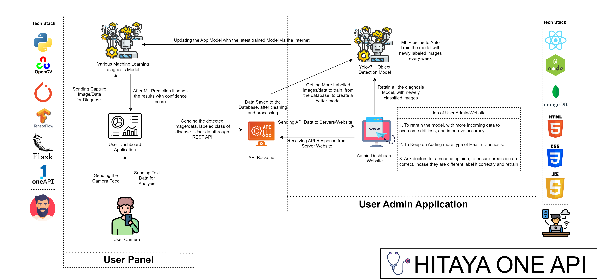
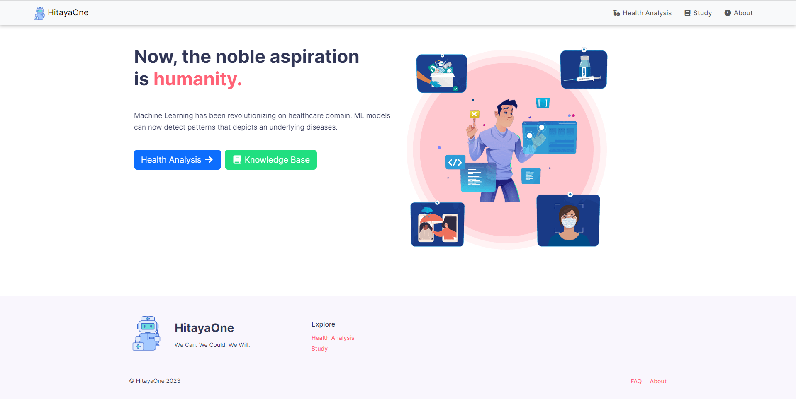
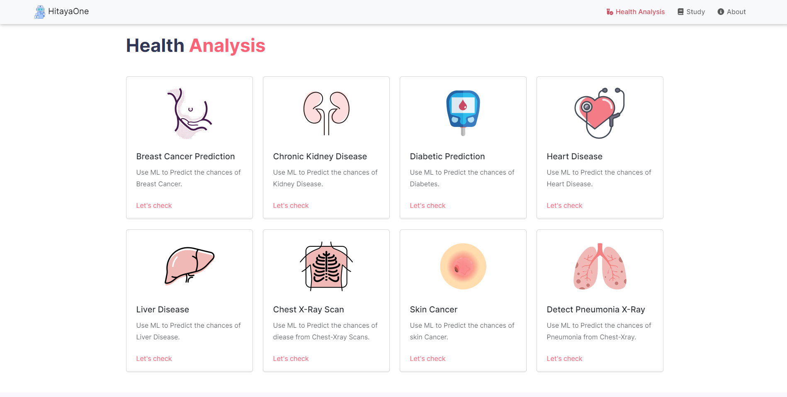
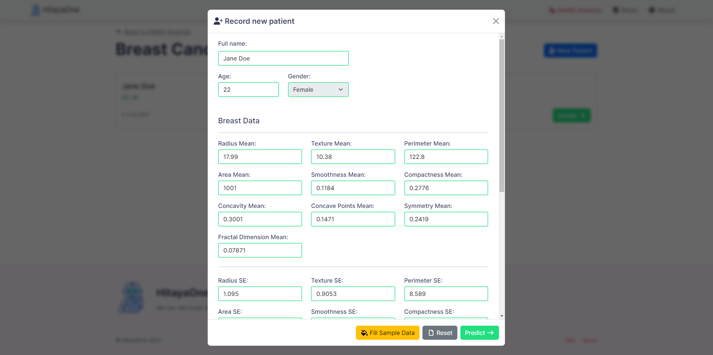
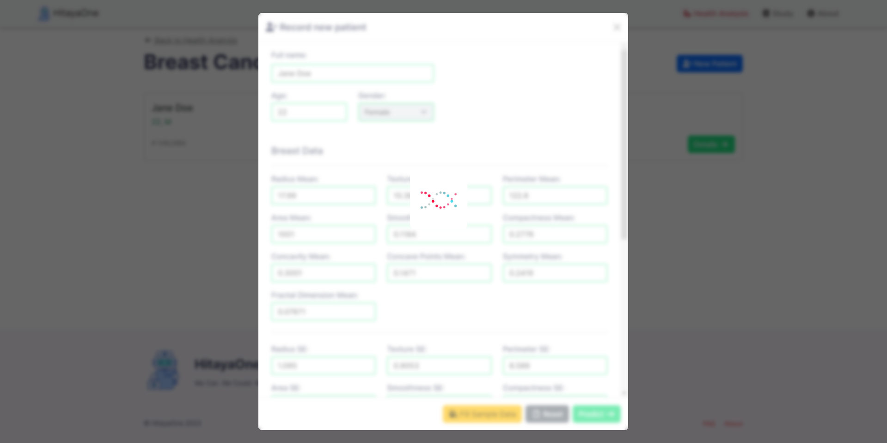
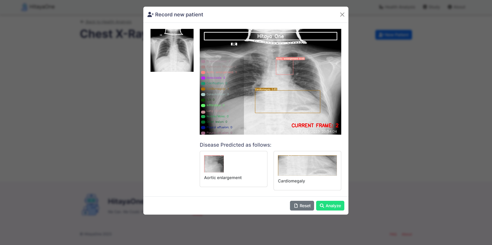
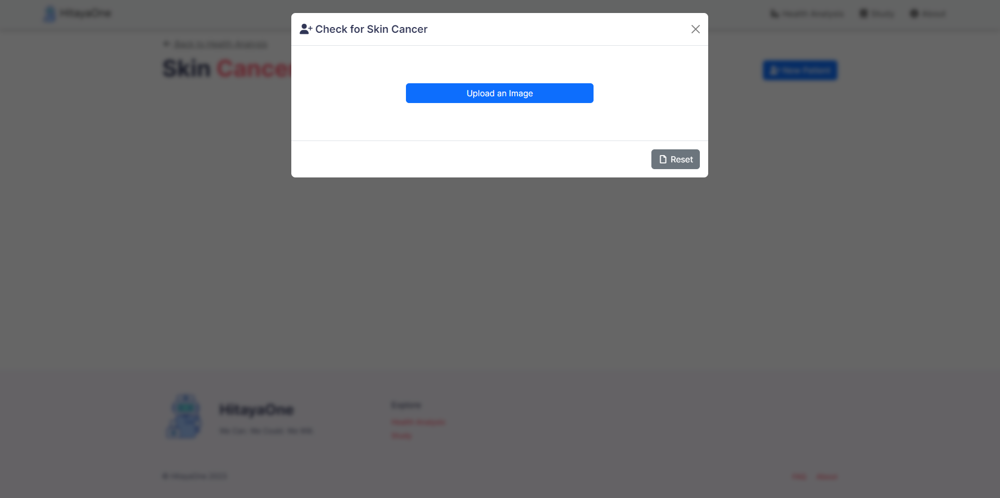
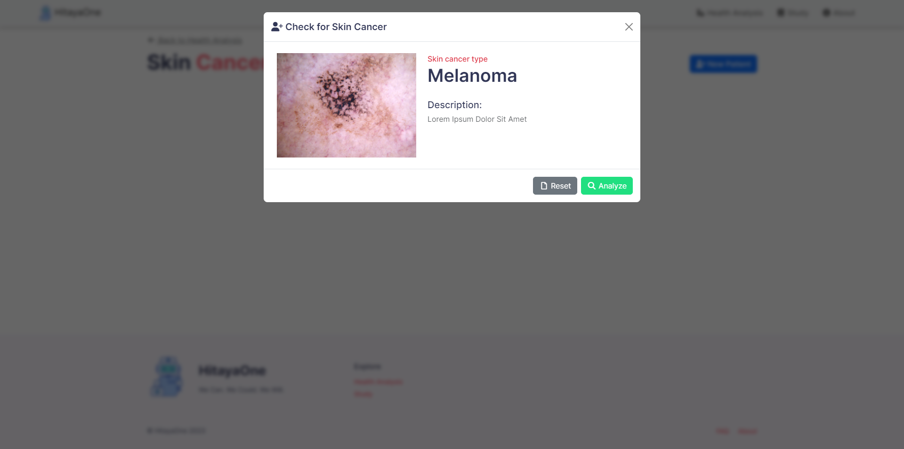
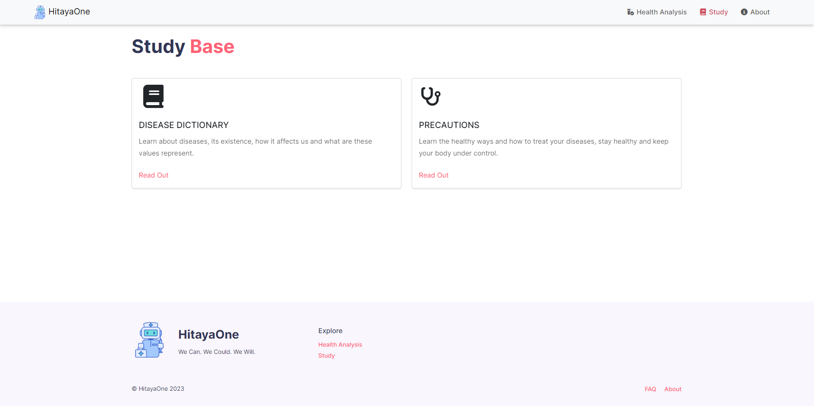
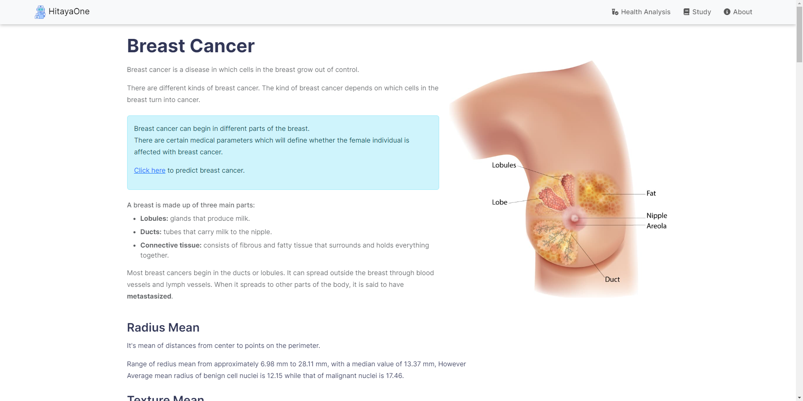

<h1 align="center"><a href="">Hitaya oneAPI</h1>
  
<strong>Hitaya oneAPI </strong>Medical diagnosis using machine learning - Machine Learning has been revolutionizing on healthcare domain. ML models can now detect patterns underlying diseases. In this way, AI techniques can be considered as the second pair of eyes that can decode patient health knowledge extracted from large data sets by summing up facts & observations of diseases. Due to the Covid-19 pandemic existing digital diagnosis methods are being preferred as people are willing to follow Covid norms & stay safe.

It provides a way for farmers to sell carbon credits in the form of NFT to industrial buyers who needs to buy carbon credits in order to achieve sustainability goals, thus giving farmers money to invest in more sustainable farming practices, and a win-win situation for all, the Air Quality verification is done using IoT devices, thus acting as a verification mechanism to ensure, that money is invested by farmers to adopt more sustainable farming methods.
  
## Features
- Creating an AI/ML preliminary diagnosis application.
- Users/Doctors can input images of x-ray scans/ medical data/ or just images and our Application will give them the diagnosis results.
- All user data will be stored using blockchain, then ensuring the security of the data .


## 1. Project Architecture

<p align="center">
  
</p>


## 2. Getting Started With The Application

```sh
$ git clone https://github.com/IntelegixLabs/Hitaya_oneAPI.git
$ cd Hitaya_oneAPI
$ pip install -r requirements.txt
$ pip install -r requirements_gpu.txt
$ pip install -r requirements_oneapi.txt
$ python app.py
```
  
### 3. Application Screenshots

<br />
<p align="center">
  
  
  
  
  
  
  
  
  
  
</p>
<br />

### 4. Medium Posts
1. [HitayaOne Overview](https://medium.com/@manijb13/hitaya-oneapi-healthcare-for-underserved-communities-5b4a563f08f7)
2. [Diabetes Prediction](https://medium.com/@manijb13/hitaya-oneapi-machine-learning-model-training-using-intel-oneapi-53b06e92b21c)
3. [Breast Cancer](https://medium.com/@raj713335/hitaya-oneapi-breast-cancer-machine-learning-model-training-using-intel-oneapi-797bf1521301)
4. [Heart Disease](https://medium.com/@raj713335/hitaya-oneapi-heart-disease-machine-learning-model-training-using-intel-oneapi-extension-for-c00b163042df)
5. [Liver Disease](https://medium.com/@raj713335/hitaya-oneapi-liver-disease-machine-learning-model-prediction-using-intel-oneapi-78129d193bb9)
6. [Chronic Kidney Disease](https://medium.com/@raj713335/hitaya-oneapi-chronic-kidney-disease-machine-learning-model-training-using-intel-oneapi-dbf6f85f1544)
7. [Skin Cancer Prediction](https://itsjb13.medium.com/hitaya-oneapi-skin-cancer-detection-using-intel-optimization-for-tensorflow-eb95d54564af)
