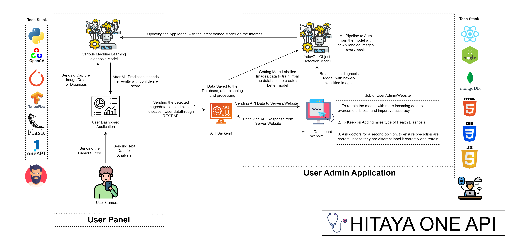

<h1 align="center"><a href="">Hitaya OneAPI</h1>


## 1. Project Architecture

<p align="center">
  
</p>


## 2. Getting Started With The Application

- Clone the repo and cd into the directory
```sh
$ git clone https://github.com/IntelegixLabs/Hitaya_oneAPI.git
$ cd Hitaya_oneAPI
$ pip install -r requirements.txt
$ python main.py
```
